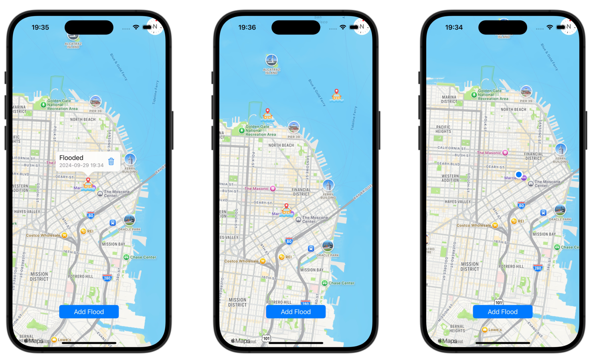

A small app where users have the ability to report floods and see other reported floods in real time.


## Screenshots/Demo



## Technologies Used

- UIKit
- Firebase Firestore
- MapKit
- CoreLocation
- CocoaPods

<!-- ## Installation

### Prerequisites
- Xcode
- Cocoapods
- Firebase account

### Installation

#### Environment Variables

To run this project, you will need to add the following environment variables to your .env file

`API_KEY`

`ANOTHER_API_KEY`

In the terminal run:

```bash
  pod install
``` -->

## Acknowledgements

 - Water-damage icons created by [Handicon - Flaticon](hhttps://www.flaticon.com/free-icons/water-damage)
 - Intermediate and Advanced iOS by [Mohammad Azam](https://azamsharp.teachable.com/)

## License

[MIT](https://choosealicense.com/licenses/mit/)

## Authors

- [@szymon-michalak](https://www.github.com/szymon-michalak)
